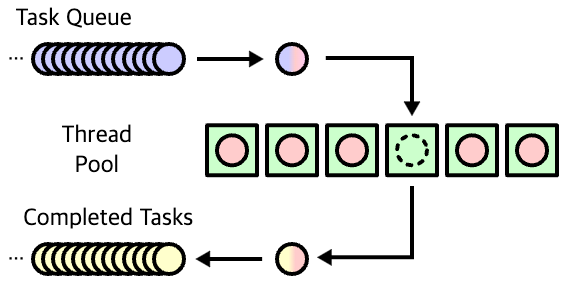

# SimpleHttpServer-step3
### Thread Pool 이란?
- 작업 수행을 기다리는 초기화된 유휴 스레드 모음입니다. Queue에 스레드가 작업을 받으면 이를 실행하고, 작업이 완료되면 스레드는 다시 새 작업을 기다리게 됩니다.
- 이러한 방식으로 스레드를 재사용하면서 시스템 리소스에 부담을 주지 않고 처리할 수 있습니다.
- CPU 및 메모리 사용량을 줄이면서 동시성을 향상할 수 있는 방법을 학습니다.
- Queue를 이용하여 Client 요청을 처리하는 대기열을 구현합니다.

